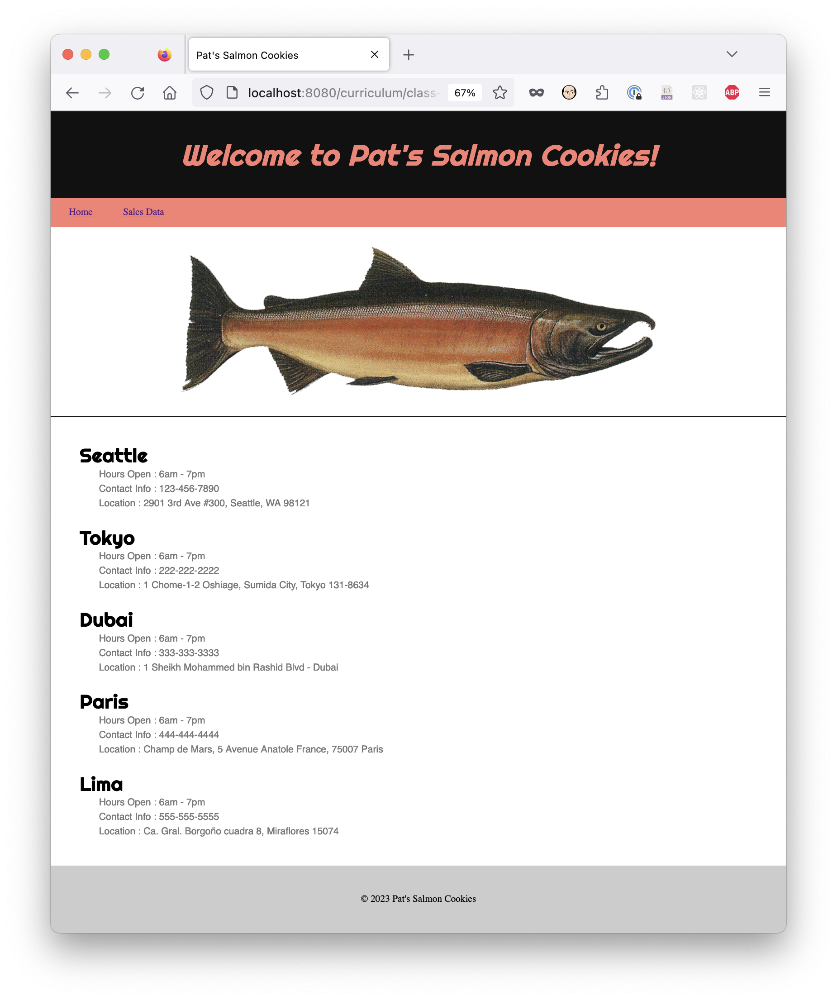
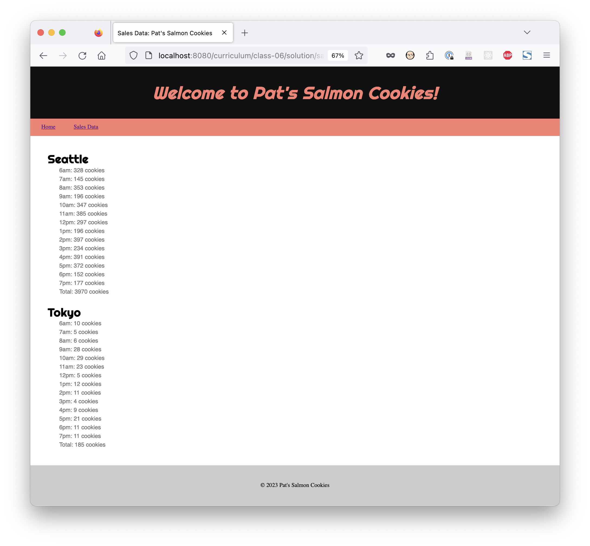
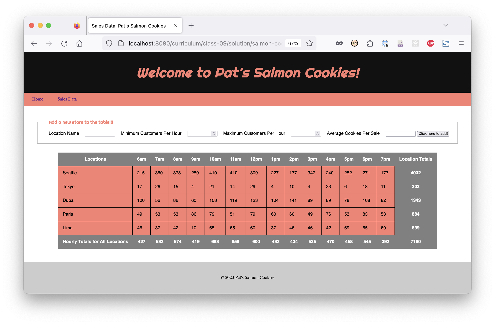

# Laboratorio: Galletas de salmón

Lee esta tarea por completo antes de comenzar con el laboratorio. Puede que desees
[abrirlo en una nueva pestaña](https://codefellows.github.io/code-201-guide/curriculum/class-06/lab/){:target="_blank"}.

## Descripción del problema

A tu amigo Pat se le ocurrió una idea de negocio al combinar su amor por los dulces y su pasión por los
ecosistemas saludables. Pat ha desarrollado una receta de dulces para merendar llamadas Galletas de salmón. Estas galletas están hechas en
la forma de un salmón y son aptas tanto para humanos como para salmones.

Pat necesita ayuda con la marca de su negocio, así como ayuda con la gestión interna de datos de la 
empresa, y ha solicitado tu ayuda por tu trabajo extenso y comprobado en el desarrollo de aplicaciones web.

Las Galletas de salmón de Pat, las cuales serán una franquicia internacional, necesitan una aplicación de desmotración conceptual para calcular el número 
de galletas que cada sucursal debe fabricar cada día para que puedan gestionar sus inventarios de suministros y sus horarios de horneado. El
número de galletas por hacer dependerá de las horas de operación (6:00 AM a 8:00 PM para todas las ubicaciones) y algunos factores
únicos de cada ubicación:

- El número mínimo de clientes por hora.
- El número máximo de clientes por hora.
- El número promedio de galletas que compra cada cliente.

Ya que su negocio recién está comenzando, necesitaremos construir una aplicación que sea adaptable. Pat necesitará
poder añadir y remover ubicaciones del informe de proyecciones diarias, y también necesitará 
modificar con facilidad el input de números por cada ubicación en base al día de la semana, eventos especiales y otros factores. A Pat le gustaría
ver estos números con un buen formato en la aplicación web.

Pat también necesita que tomes el liderazgo en implementar el diseño y la construcción de una página pública.
El equipo de diseño ha creado un logo (abajo), y el framework para el aspecto y el estilo de la página web, incluyendo el 
esquema de colores, fuentes, e imágenes adicionales para el sitio público.

Entonces, además de crear una aplicación que calcule las proyecciones de venta diarias para cada ubicación (en una página llamada
sales.html), también necesitarás crear una página pública (en la página inicial index.html) que encaje con el prototipo creado
por el equipo de diseño, e incluya la información y assets requeridos.

Tienes mucho por hacer.
*Planifica tu trabajo y trabaja con tu plan*.

### Página inicial

### Página de ventas (versión inicial)

### Página de ventas (versión final)

## Instrucciones

Antes de comenzar, crea un nuevo repositorio en GitHub llamado "cookie-stand". Asegúrate de que este repositorio esté
debidamente configurado con una licencia y un readme. Clona este repositorio a tu equipo local.

Crea dos páginas nuevas en tu proyecto. Una para los datos de ventas (sales.html) y otra para la página inicial (index.html).
También necesitarás crear por lo menos un archivo JavaScript. Ejemplo: `app.js`.

### Datos de ventas

En tu archivo javascript, crea objetos literales JS por cada ubicación de la tienda. Cada ubicación será
responsable por generar datos de ventas y proveer el output en un documento html. También deberás ejecutar las
siguientes tareas en tu archivo javascript.

1. Almacenar los clientes min/max por hora, y el promedio de galletas por cliente en las propiedades de un objeto.
1. Generar un número al azar de clientes que se pueda utilizar para simular las ventas por hora, utilizando [Objects/Math/random](https://developer.mozilla.org/en-US/docs/Web/JavaScript/Reference/Global_Objects/Math/random){:
   target="_blank"}
1. Calcular y almacenar la cantidad simulada de galletas compradas por hora en cada ubicación utilizando la cantidad promedio de galletas compradas 
   y el número generado al azar de clientes.
1. Almacena los resultados por cada ubicación en un array por separado... quizás como una propiedad de objeto representando su
   ubicación.
1. Muestra los valores de cada array como listas no ordenadas en el navegador.
1. Al calcular la suma de estos totales por hora, tu output por cada ubicación se debería ver así:

   Seattle

- 6am: 16 galletas
- 7am: 20 galletas
- 8am: 35 galletas
- 9am: 48 galletas
- 10am: 56 galletas
- 11am: 77 galletas
- 12pm: 93 galletas
- 1pm: 144 galletas
- 2pm: 119 galletas
- 3pm: 84 galletas
- 4pm: 61 galletas
- 5pm: 23 galletas
- 6pm: 42 galletas
- 7pm: 57 galletas
- Total: 875 galletas

Muestra las listas en sales.html como se muestra en el wireframe "Datos de ventas - Inicial" Añadiremos características a esta
aplicación y trabajaremos con su layout en los
próximos laboratorios.

Estos son los números iniciales que necesitarás para construir estos objetos:

 Ubicación | Min / Client. | Max / Client. | Avg Galletas/ Venta
----------|------------|------------|-------------------
 Seattle  | 23         | 65         | 6.3
 Tokyo    | 3          | 24         | 1.2
 Dubai    | 11         | 38         | 3.7
 Paris    | 20         | 38         | 2.3
 Lima     | 2          | 16         | 4.6

Estos números solo son estimaciones de Pat por ahora, pero eventualmente, una vez que haya un historial recolectado que
proporcione números más acertados, necesitaremos la capacidad de actualizar estos números para cada ubicación, y añadir/remover
ubicaciones. Pero no haremos todo eso hoy. **Asegúrate de que cada ubicación sea su propio objeto de JavaScript**.

### Página inicial

Lee los requisitos para tu página `index.html` a continuación.

Nota: Todo lo enumerado a continuación es un logro adicional para el laboratorio 06. Todos estos requisitos serán necesarios para
el envío final del proyecto, así que comienza a implementarlos pronto.

Además de la imagen proporcionada del pez, tu archivo `index.html` debe contener:

1. Muestro [Google Font](https://fonts.google.com/){:target="_blank"} sans-serif modificado para utilizarlo en las etiquetas de títulos (`<h# />`)
   llamado "Righteous"
1. Una fuente web específica san-serif para los datos de ventas (como Arial, Verdana, o Helvetica).
1. Una fuente web específica serif para los textos (como Georgia, Times).
1. Diferentes colores de fuente específicos para los 3 tipos de fuentes.
1. Fondo del header: Negro
1. Navegación del header: Fondo salmón, texto de enlaces negro
1. Fondo de la página: Blanco
1. Sé riguroso en tu implementación del layout diseñado y organización general de la página.
1. Ejecuta un informe de Accesibilidad de Lighthouse. En este módulo, procura obtener una puntuación de 65-80. Añade la captura de pantalla de
   tu puntuación a tu README.md.
1. Incluye todas las cosas usuales que encontrarías en la página principal de un negocio: ubicaciones, horas, información de
   contacto, algo de texto acerca de lo genial que es el negocio, etc. Sé creativo, y una vez más, piensa en lo más importante
   para un usuario promedio.

#### Guía de estilo de desarrollo

Además de los requisitos mencionados anteriormente, por favor asegúrate de que tu proyecto también contenga lo siguiente de acuerdo a 
nuestra guía de estilo:

1. Por cada laboratorio con este proyecto, crearás una rama nueva por cada día. Crea un nombre para la rama nueva que
   siga el siguiente formato `class##-funcionalidad` (ejemplo: `class06-Objetos`).
1. En la versión local de tu repositorio, añade tu `.gitignore` y `.eslintrc.json`.
1. Mientras trabajas en tu rama que no es la main, ejecuta commits regularmente con git.
1. Todas las propiedades/valores y métodos deberán ser construidos correctamente y se le deberán dar nombres pertinentes.
1. Las funciones y los métodos deberán seguir el principio de responsabilidad única.
1. Utiliza plantillas literales en tu lógica de JS para mostrar las tiendas como listas en la página de ventas.

### Logros Adicionales

1. Lee [este artículo](https://mentormate.com/blog/low-fidelity-wireframes-vs-high-fidelity-wireframes/){:target="_
   blank"} y [este artículo](https://www.justinmind.com/blog/low-fidelity-vs-high-fidelity-wireframing-is-paper-dead/){:
   target="_blank"} acerca de las diferencias entre wireframes de baja fidelidad y de alta fidelidad. En base a estas lecturas, saca
   tus conclusiones acerca de lo que quisieras en tus wireframes de baja y alta fidelidad.*
1. Crea un wireframe de baja fidelidad sobre la apariencia que te gustaría que tuviera tu página.
1. Crea un wireframe de alta fidelidad sobre la apariencia que te gustaría que tuviera tu página.

## Recursos

- Consulta el documento [Setting up a new project](../../class-02/project-setup){:target="_blank"} para hacer la
  configuración del archivo/directorio de este proyecto.

## Instrucciones de envío

- Envía el enlace a tu repositorio de GitHub para este proyecto.
- Despliega tu repositorio de GitHub
  utilizando [Github Pages](https://docs.github.com/en/pages/getting-started-with-github-pages/creating-a-github-pages-site#creating-your-site){:
  target="_blank"}. Envía el enlace a tu repositorio de GitHub para este proyecto.
- Añade un comentario a tu envío en Canvas con las respuestas a las siguientes preguntas
  - ¿Cómo te fue, en general?
  - ¿Qué observaciones o preguntas tienes acerca de lo que hemos aprendido hasta ahora?
  - ¿Cuánto tiempo te tomó terminar esta tarea? Y, antes de que comenzaras, ¿cuánto tiempo creiste que te tomaría terminar esta tarea?

