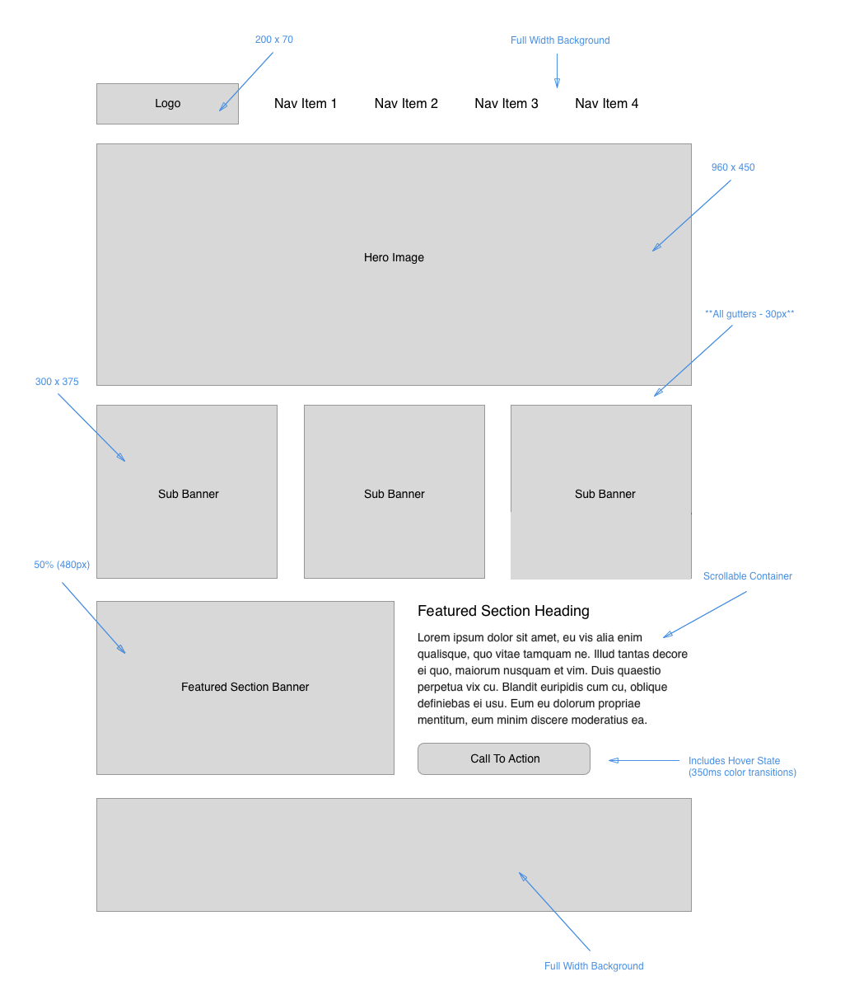

# Ejercicio de wireframe HTML/CSS

Lee el documento por completo antes de comenzar con el trabajo del laboratorio. Para ver esta tarea de laboratorio en su propia prestaña, haz click [aquí](https://entertechschool.github.io/code-201-guide/curriculum/class-08/lab-a/){:target="_blank"}

## Descripción del problema

Hoy practicarás construyendo un wireframe profesional a partir de especificaciones proporcionadas. Solo se permite utilizar HTML y CSS. No se pueden utilizar frameworks o librerías adicionales.

Este es el wireframe que vas a construir. Encontrarás una versión más grande de esta imagen en tu repositorio del día de clase correspondiente.

Aquí está la versión con anotaciones y algunos otros detalles:

Los wireframes profesionales deben mantener la presentación del sitio simple y sin contenido adicional. El propósito de un wireframe es definir el layout, mientras que el contenido real puede añadirse en el futuro. Los wireframes le permiten al cliente decidir qué layouts les gusta y cuáles no. Tradicionalmente los wireframes solo contienen:

1. Imágenes placeholder
1. Texto de placeholder como [lorem ipsum](https://es.lipsum.com/){:target="_blank"}

Las imágenes placeholder son un buen recurso en un wireframe ya que son marcadores de posición con un tamaño que depende de la url que especifiques. Ejemplo: `` produce la siguiente imágen, con un año de 200 pixeles, una altura de 300 pixeles, y un color `#DDD`, el cual es gris claro:

Evita utilizar imágenes reales, ya que pueden quitarle fuerza al layout o tema del wireframe. Pueden ser una distracción para el cliente durante la colaboración y construcción del wireframe.

## Instrucciones

Crea un nuevo repositorio llamado 'wirefame-exercise', asegúrate de configurarlo con `index.html`, `style.css`, y `reset.css` (utiliza [Eric Meyer's reset](https://meyerweb.com/eric/tools/css/reset){:target="_blank"}).

Considera adoptar un enfoque más profesional al desarrollo web planificando tu enfoque antes de comenzar con el código.

1. Ten un concepto de diseño y un plan listos antes de escribir la primera línea de código.
    - Construye/revisa un wireframe mostrando todas las dimensiones del documento
    - Ten en claro dónde irán las imágenes y qué tan grandes van a ser
    - Utiliza imágenes placeholder durante el proceso de preparación
    - Ten en claro dónde irá el texto y utiliza el texto de placeholder *lorem ipsum*
1. Confugura el repositorio del proyecto, estructura los archivos y asegúrate de que estén conectados.
1. Construye todo el HTML sin utilizar ninguna clase o ID
1. Al trabajar en el documento, coloca los elementos en su lugar con CSS, utilizando la estructura del HTML para crear selectores siempre que sea posible. Limita el uso de clases e IDs sólo donde sean necesarias.
1. Añade color, fondos, border, estilos de texto, etc. de acuerdo a las especificaciones del diseño.

Después de cada paso, asegúrate de hacer "ACP" en tu flujo de trabajo git.

Una vez se haya establecido el wireframe, puedes presentarlo al diseñador y/o al cliente para que lo revise, realice las modificaciones necesarias y, una vez aprobado, comiences a añadir el contenido real.

## Recursos

Busca en el directorio del repositorio de la clase de hoy en GitHub una versión más grande del wireframe y del wireframe con anotaciones.

## Instrucciones de envío

El equipo de instructores evaluará tu tarea y te darán retroalimentación.

1. Envía el enlace de tu repositorio para este proyecto.
1. Añade un comentario a tu envío con las respuestas a las siguientes preguntas.
    - ¿Cómo te fue, en general?
    - ¿Qué observaciones o preguntas tienes acerca de lo que hemos aprendido hasta ahora?
    - ¿Cuánto tiempo te tomó terminar esta tarea? Y, antes de que comenzaras, ¿cuánto tiempo creiste que te tomaría terminar esta tarea?
