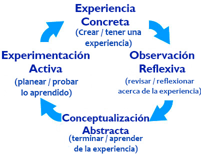

# Registro de aprendizaje

## Hoy aprendí

Que una de las herramientas más útiles en la educación para adultos es la reflexión. Al escribir resúmenes de las lecciones aprendidas, consolidamos el aprendizaje y profundizamos en el entendimiento de un tema. También ayuda a medir nuestro progreso.

## Andragogía vs Pedagogía

¿Quizás has visto un gráfico similar a este antes?

Este es un modelo de estilo de aprendizaje desarrollado por el investigador David Kolb y es un principio fundamental en la forma en la que está diseñado nuestro plan de estudios y cómo se enseña en Enter Tech School. Ten en cuenta el componente de "Observación Reflexiva"; es un diferenciador principal entre la forma en la que aprenden los adultos y la forma en que aprenden los niños.

Como adulto, aprender es diferente en comparación a como lo era cuando eras más joven. Haz una lectura rápida de [este artículo](https://elearningindustry.com/pedagogy-vs-andragogy-in-elearning-can-you-tell-the-difference){:target="_blank"} que describe la diferencia entre andragogía (aprendizaje orientado a adultos) y pedagogía (aprendizaje orientado a niños).

Durante este curso habrá una serie de tareas en su registro de aprendizaje donde se te pedirá reflexionar acerca de lo aprendido. La reflexión es una parte crucial del aprendizaje en adultos, y la autoconsiencia que resulta es un componente clave de la inteligencia emocional. Inicialmnte, en estas tareas te darán instrucciones para comenzar, pero mientras pase el tiempo, algunas tareas serán menos estructuradas para que puedas explorar tus pensamientos con más autodeterminación y libertad.

## Reflexión

Escribe una relfexión breve acerca de lo aprendido hoy, o utilizar la siguiente indicación para comenzar.

Considera la siguiente cita del artículo vinculado anteriormente:

> "Los [estudiantes adultos] están sumamente involucrados no solo en la planeación, si no también en evaluar su aprendizaje, conforme tienen en claro qué conocimiento quieren adquirir."

En otras palabras, deberías evaluar consistentemente tu aprendizaje, y tu registro de aprendizaje es una excelente forma de monitorearlo. ¿Cómo te ves planeando y evaluando tu aprendizaje? ¿Qué detalles vas a registrar y/o medir? ¿Cada cuánto tiempo vas a evaluar lo aprendido?

***Registra tus pensamientos en el área de texto a continuación, tendrás una tarea como esta en cada clase. Ten en cuenta que tu instructor y TA tendrán acceso a tu registro en esta tarea, pero este contenido no es visible al público.**
