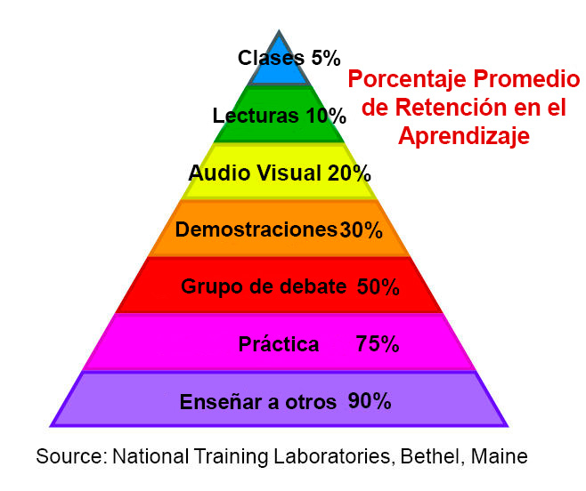

# Registro de aprendizaje

## Hoy aprendí

Que una de las herramientas más útiles en la educación para adultos es la reflexión. Al escribir resúmenes de las lecciones aprendidas, consolidamos el aprendizaje y profundizamos en el entendimiento de un tema. También ayuda a medir nuestro progreso.

Probablemente solo debas emplear como 10-15 minutos en esta tarea, aunque si ves que es útil invertir más tiempo, puedes hacerlo.

## Reflexión

Escribe una relfexión breve acerca de lo aprendido hoy, o utilizar la siguiente indicación para comenzar.

Considera la "pirámide de aprendizaje" como se muestra en la imagen a continuación. ¿Se parece a la forma en la que aprendes, o distribuirías las actividades de forma diferente? De ser así, ¿cómo?

